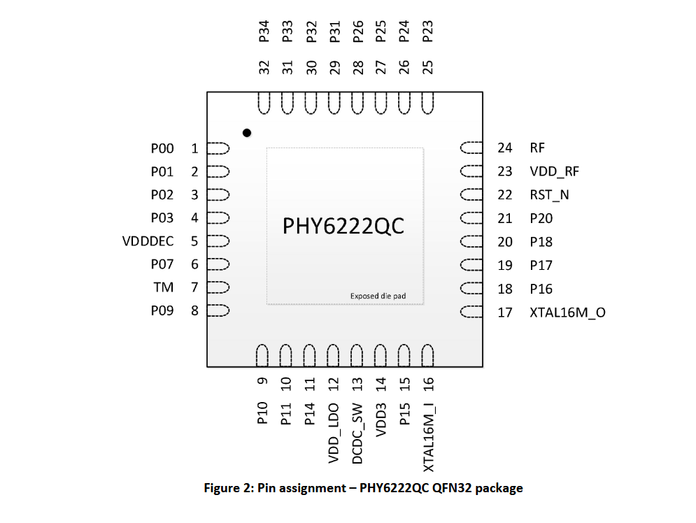

# Hardware

Every pin below was read out of the stock firmware's GPIO calls, then confirmed
on the watch with a probe program. The code's single source of truth is
[lib/core/board.h](../lib/core/board.h).

## SoC

| Item       | Details                                                     |
| ---------- | ----------------------------------------------------------- |
| Chip       | Phyplus PHY6222QC, QFN32 ([datasheet](PHY6222_BLE_SoC_Datasheet_v1.5_20231101.pdf)) |
| Core       | ARM Cortex-M0, 48 MHz by default                            |
| Flash      | 512 KB, mapped at `0x11000000`                              |
| SRAM       | 64 KB at `0x1fff0000`                                       |
| Radio      | BLE 5                                                       |
| 32 kHz     | No crystal (its pins are used for the backlight); BLE timing runs on the RC oscillator |

## Pin Map

| Pin                  | Function                    | Notes                                     |
| -------------------- | --------------------------- | ----------------------------------------- |
| P24 P25 P31 P32 P34  | Display RST, DC, CS, SDA, SCL | 3-wire SPI, SDA is bidirectional        |
| P01 P02 P16 P17      | Backlight                   | Active low; all LOW = full brightness     |
| P11                  | Touch button                | Active high, pull-down                    |
| P03                  | Vibrator                    | Active high                               |
| P00                  | Heart-rate LED (back)       | Active low                                |
| P18                  | Ball / tilt switch          | Low at rest; bounces on every shake       |
| P14                  | Battery voltage             | ADC, 1/5.5 divider                        |
| P15                  | Charger detect              | Active high; only valid with P23 LOW      |
| P23                  | Charger-related output      | Keep LOW (role not pinned down yet)       |
| P07                  | Factory-test strap          | Read once at boot; LOW = stock test mode  |
| P09 P10              | UART TX, RX                 | Log output and the flashing port          |

The stock firmware never drives P20, P26, P27 or P33, and never uses I2C.

## Peripherals

- **Display:** 80×160 TFT with a JD9850-type controller (ID `98 50 00`, read
  back from the panel). Driver: [lib/display](../lib/display/).
- **No accelerometer.** Steps and shake-to-wake come from the ball switch on
  P18: one shake bounces it many times, and the stock firmware counts a burst
  of pulses as one event, ending after 350 ms of quiet.
  [lib/motion](../lib/motion/) does the same.
- **No real heart-rate sensor.** The stock "heart rate" blinks the P00 LED for
  up to 60 s, then shows a random number (`osal_rand()`).
- **Battery:** 3.71 V measured on battery, about 3.9 V while charging. In this
  SDK `hal_adc_value_cal()` returns millivolts.
  [lib/power](../lib/power/) gives `battery_mv()`, `battery_percent()` and
  `charger_present()`. The percentage reads high while charging.

## Stock Firmware Layout

| Flash offset | Contents                                            |
| ------------ | --------------------------------------------------- |
| `0x2000`     | Boot table → the OTA bootloader                     |
| `0x3000`     | App table: XIP code `0x11020000`–`0x1103c450`, SRAM image loaded from `0x11000` |
| `0x4000`     | The watch's BLE address, lowest byte first          |

The Ghidra project and how to rebuild it:
[ghidra_project/README.md](../ghidra_project/README.md).
